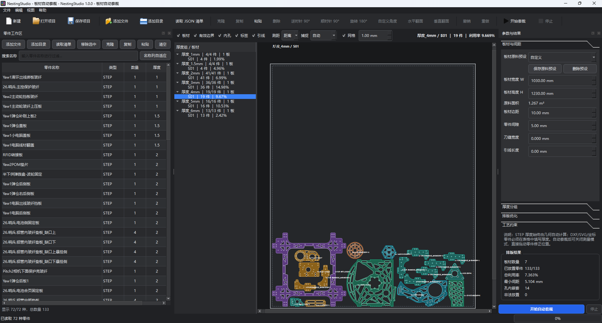

# NestingStudio

NestingStudio 是一个面向板材切割的桌面自动套裁与嵌套排版软件。它采用类似 Bambu Studio 的可视化工作流：左侧管理零件，右侧配置材料与工艺参数，中间查看每个厚度组和每张板材的排版结果。



## 核心能力

- 支持 STEP/STP、DXF、SVG 和多边形 JSON 输入。
- STEP 自动从 B-Rep 几何计算厚度。
- DXF/SVG/坐标输入必须明确提供 `thickness_mm`；程序绝不从零件名称推断厚度。
- 强制按厚度分组，每个厚度组独立排版、独立开板和独立导出。
- 可配置板材宽度、高度、边距、零件间隙、刀缝、引线长度等参数。
- 支持大件内孔中嵌套小件。
- 支持 0°、90°、180°、270° 或任意自定义旋转角。
- 支持纹理/轧制方向锁定。
- 支持热密度约束、边距校验、真实轮廓间距校验。
- 支持 Greedy、Simulated Annealing（SA）和 Genetic Algorithm（GA）。
- 可视化显示板材、有效边界、外轮廓、内孔、标签和引线。
- 导出分层 DXF、逐件坐标 CSV 和全局 JSON 报告。
- 保存和重新打开 `.neststudio.json` 项目。

## 安装

推荐 Python 3.10 以上版本。

```powershell
cd NestingStudio
python -m pip install -r requirements.txt
```

依赖包括：

- PySide6：桌面图形界面。
- CadQuery/OpenCascade：STEP 读取、厚度计算和 2D 投影。
- Shapely/GEOS：碰撞、孔洞、偏移和几何校验。
- ezdxf：DXF 读写。
- svgelements：SVG 曲线解析。
- PyClipper：预留高精度偏移和共边切割扩展。

## 启动软件

双击：

```text
run_nesting_studio.bat
```

或者运行：

```powershell
python -m nesting_studio
```

也可以直接双击 `NestingStudio.pyw`，以无控制台窗口方式启动。

## 操作流程

1. 点击“添加文件”“添加目录”或“读取 JSON 清单”。
2. 在左侧零件表中核对数量和允许旋转角。
3. 对于 STEP 零件，厚度由几何自动显示，不能手工覆盖。
4. 对于 DXF/SVG/坐标零件，在“厚度”列填写真实厚度，或在参数面板设置“2D 默认厚度”。
5. 在右侧设置板材尺寸、边距、零件间隙、刀缝、引线长度、热密度和优化器。
6. 点击“开始套裁”。
7. 在左侧“厚度组 / 板材”树中切换板材，在中间画布中查看排版。
8. 用滚轮缩放、中键拖动画布；右上方可切换板材、边界、内孔、标签和引线图层。
9. 点击“导出 DXF”，输出可直接进入后处理流程的分组文件。

## 手动拖动修正

自动套裁完成后，可以直接在画布上拖动零件来修正算法结果。

1. 关闭“测量”模式。
2. 用鼠标左键按住需要调整的零件。
3. 拖动时实时检查板材边界、零件间隙和热密度。
4. 有效位置显示青色提示；无效位置显示红色虚线和原因。
5. 松开鼠标后位置会保留；非法位置只标红提醒，不再自动回退。
6. 默认按 1 mm 网格吸附；按住 `Shift` 可临时关闭网格。
7. 顶部“网格”开关和步长输入框可以修改吸附设置。
8. `Ctrl+Z` 撤销，`Ctrl+Y` 或 `Ctrl+Shift+Z` 重做。
9. 手动调整后的坐标会保存到 `.neststudio.json` 项目文件，重新打开可继续修改。

拖动零件时会自动重新计算内孔嵌套关系、碰撞轮廓、捕捉点和板材统计。安全间距不足时不会允许放置。
## 辅助操作

### 直接拖入

可以把 STEP、DXF、SVG、JSON 文件或整个目录直接拖入主窗口。程序会自动识别文件类型；目录会递归扫描。

### 直接编辑画布中的模型

- 左键点击模型后，可直接按 `Ctrl+C` 复制该模型。
- `Ctrl+V` 在当前板材粘贴一个新实例。
- `Ctrl+D`：弹出“克隆数量”窗口，可一次克隆多个模型。
- 模型克隆会在一次撤销命令中批量添加，并按网格间距依次错开放置。
- 复制粘贴一次增加一个模型，克隆 `N` 个增加 `N` 个。
- 克隆和粘贴会同步增加零件类型的总数量，重新自动排版时数量不会丢失。
- `Delete` 删除当前选中的模型。
- 模型右键菜单也提供克隆、复制、粘贴和删除。
- 重叠、间距不足或越界时只显示红色提醒，位置仍会保留。
- 红色模型会写入报告中的 `manual_error` 字段，导出前可继续修正。
- 所有模型级添加、克隆和删除均可撤销、重做。
### 旋转与翻面

选中模型后可以使用工具栏、右键菜单或快捷键调整方向：

- `R`：顺时针旋转 90°。
- `Shift+R`：逆时针旋转 90°。
- 工具栏：顺时针 90°、逆时针 90°、旋转 180°。
- `H`：水平翻面。
- `V`：垂直翻面。
- 翻面会保持几何真实镜像，不会只修改显示。
- 旋转和翻面都会重新计算内外轮廓碰撞，并执行非法位置红色提醒。
- 旋转、翻面支持撤销、重做、复制粘贴和项目保存恢复。
- 复制或克隆后的镜像模型会保留翻面状态。
- STEP 零件默认锁定正面朝上，防止改变沉孔、沉槽和加工面方向。
- 锁定状态下允许旋转 90°/180°，但禁止水平或垂直翻面。
- 在模型右键菜单中选择“允许翻面”可解除锁定；再次选择“锁定正面”可恢复保护。
- 清单中可通过 `"face_up_locked": true/false` 设置初始锁定状态。
### 克隆与复制粘贴

- `Ctrl+D`：克隆当前选中的零件类型，克隆项共享同一轮廓几何，不重复解析文件。
- `Ctrl+C`：复制选中的零件参数。
- `Ctrl+V`：粘贴零件，并自动生成不重复的零件名称。
- `Delete`：移除选中零件。

也可以在零件表右键打开“克隆、复制、粘贴、移除”菜单。

### 测量

1. 点击工具栏“测量”或按 `Ctrl+M`。
2. 在顶部测量模式中选择“距离”或“半径”。
3. 捕捉模式支持“自动、端点、中点、圆心/圆孔、中心”。
4. 距离模式点击两个点，显示距离、ΔX、ΔY。
5. 半径模式直接点击圆孔、圆形外轮廓或圆心，程序自动拟合圆心和半径，显示 `R`、直径 `D`。
6. 中点捕捉可用于测量孔中心距、边中点到边中点距离。
7. 可连续建立多组测量，点击“清除测量”删除全部测量标记。
8. 测量模式下右键取消当前未完成的测量。

### 视图控制

- 鼠标滚轮：缩放。
- 鼠标中键拖动：平移。
- “适合窗口”：自动适应当前板材范围。
- 图层开关：控制板材、有效边界、内孔、标签和引线显示。
## 零件表搜索与显示

左侧零件表支持：

- 按零件名称实时搜索和过滤。
- 搜索同时匹配名称、来源路径和文件类型。
- 拖动表头分隔线手动调整列宽。
- 长名称自动换行并显示完整悬停提示。
- “名称列自适应”按钮可按最长名称自动调整名称列。
- 搜索后复制、删除、修改数量和旋转角仍作用于筛选后的真实零件。

## 自动套裁进度

点击“开始自动套裁”后，进度条立即进入动态忙碌状态，不再看起来像未响应。

收到后台进度后会切换为百分比模式，并实时显示：

- 当前厚度组
- 当前放置零件数量
- SA/GA 迭代进度
- 当前最优代价

任务结束、取消或失败时，进度条都会离开忙碌状态。
## 参数说明

| 参数 | 说明 |
|---|---|
| 板材宽度/高度 | 原料矩形板的 W、H |
| 板材边距 | 真实零件轮廓到板材边缘的最小距离 |
| 零件间隙 | 真实零件轮廓之间的最小安全距离，允许设置为 0 |
| 刀缝宽度 | 切割光束/刀具宽度 |
| 引线长度 | 穿孔引线预留长度 |
| 厚度分组容差 | 用于合并几何计算产生的微小浮点误差 |
| 2D 默认厚度 | 仅用于缺少厚度的 DXF/SVG/坐标零件 |
| 热影响半径 | 局部材料密度统计半径 |
| 热密度上限 | 超过该密度时拒绝新零件位置 |
| 曲线离散容差 | 圆弧和样条的离散精度 |
| 优化器 | Greedy、SA 或 GA |
| 每组时间上限 | 防止复杂任务无限运行 |

安全间距采用：

```text
effective_clearance = max(part_clearance, kerf + 2 × lead_length)
```

有效边距采用：

```text
effective_edge_margin = margin + kerf / 2 + lead_length
```

最终报告会使用未外扩的真实轮廓重新测量间距，而不是只相信中间碰撞几何。

## 输出

导出目录保持厚度隔离：

```text
output/
├─ 厚度_1mm/
│  ├─ nesting_sheet_01.dxf
│  ├─ nesting_placements.csv
│  └─ nesting_layout.json
├─ 厚度_3mm/
│  ├─ nesting_sheet_01.dxf
│  ├─ nesting_sheet_02.dxf
│  ├─ nesting_placements.csv
│  └─ nesting_layout.json
└─ nesting_global_summary.json
```

DXF 图层：

- `SHEET_BORDER`
- `USABLE_BOUNDARY`
- `PART_OUTER`
- `PART_HOLE`
- `PART_LABEL`
- `LEAD_IN`

## 打开项目与导出报告

标准可编辑项目文件扩展名为：

```text
*.neststudio.json
```

保存的项目包含零件定义、数量、旋转角、手工布局、镜像状态和配置参数。

也可以直接打开导出的：

```text
nesting_global_summary.json
```

程序会从报告中的放置记录和源文件路径恢复零件与板材布局。恢复时需要原始 STEP/DXF/SVG 文件仍位于报告记录的路径。纯多边形坐标且没有源 CAD 文件的零件无法从导出报告恢复，请保存 `.neststudio.json` 项目。

打开导出报告后，如果执行“保存项目”，会提示保存为新的 `.neststudio.json`，不会覆盖原报告。
## 原料预设与自动恢复

右侧“板材与间距”支持保存、选择、删除自定义原料预设。自定义预设将长期保存在 Qt `QSettings` 中。

程序每次关闭时还会自动保存：

- 板材和工艺配置
- 零件列表、数量和允许角度
- 厚度分组
- 每张板上的零件位置
- 旋转角、镜像状态和手工布局

下次启动时会自动恢复最近一次配置和排版。打开 `.neststudio.json` 项目时，项目中的配置会覆盖上次配置。

## 自定义旋转与自动角度优化

- 模型右键菜单和工具栏支持“自定义角度...”，可输入 `-360°～360°` 的任意角度。
- Greedy 自动套裁会对每个零件尝试其全部允许角度，再选择更紧凑的位置。
- SA/GA 会同时优化零件顺序与允许旋转角。
- 自动尝试的角度来自零件表中的“允许角度”设置。
- STEP 零件默认保持正面锁定，自动角度尝试只使用平面旋转。
## 运行日志

程序会记录后台解析、自动套裁、拖动开始/移动/释放、合法校验、模型克隆、复制、删除和异常堆栈。

日志位置：

```text
NestingStudio/logs/nesting_studio.log
```

日志采用滚动文件，最多保留 3 个历史文件，每个文件最大 5 MB。可通过菜单“帮助 → 打开日志”直接打开日志目录。

开发排查时可设置更详细日志：

```powershell
$env:NESTING_STUDIO_LOG_LEVEL="DEBUG"
python -m nesting_studio
```
## 解析诊断

如果 STEP/DXF/SVG 未解析成功，程序会把完整路径、异常类型和堆栈写入运行日志。存在无效零件时，警告框可展开“详细信息”并直接复制原因。

发布版可在命令行执行：

```powershell
.\NestingStudio.exe --diagnose --report .\nesting_diagnostic.json "D:\零件目录"
```

诊断报告包含每个文件的状态、厚度、面积、孔数，以及失败时的完整异常堆栈。

## 项目结构

```text
NestingStudio/
├─ nesting_studio/          # PySide6 桌面应用
│  ├─ app.py
│  ├─ main_window.py
│  ├─ config_panel.py
│  ├─ part_table.py
│  ├─ canvas.py
│  ├─ workers.py
│  └─ theme.py
├─ nesting/                 # 与 UI 解耦的几何和算法库
│  ├─ geometry.py
│  ├─ inputs.py
│  ├─ step_input.py
│  ├─ engine.py
│  ├─ optimize.py
│  ├─ pipeline.py
│  ├─ output.py
│  └─ common_line.py
├─ auto_nest.py             # 命令行入口
├─ step_thickness_classifier.py
├─ examples/nesting_manifest.json
├─ tests/
├─ requirements.txt
└─ pyproject.toml
```

## 命令行模式

GUI 和 CLI 共用同一后端：

```powershell
python auto_nest.py "D:\零件STEP" `
  -W 2440 -H 1220 `
  --margin 10 --clearance 5 `
  --kerf 2 --lead-length 5 `
  --optimizer greedy
```

DXF/SVG 必须指定厚度：

```powershell
python auto_nest.py "D:\DXF零件" --thickness 3.0 -W 2440 -H 1220
```

详细 CLI 文档见 `docs/CLI.md`。

## 测试

```powershell
python -m unittest discover -s .\tests -v
```

测试包含：

- 多厚度零件强制分组。
- 内孔嵌套。
- 安全间距、边距和重叠校验。
- DXF 输入孔洞重建。
- DXF 分层输出。
- STEP 几何厚度和宽面投影。
- GUI 主窗口、画布与结果导航冒烟测试。
- 文件拖入接受、零件克隆与复制。
- 两点吸附测量、圆孔半径拟合和距离标注。
- 真实鼠标拖动、连续拖动、网格吸附、碰撞校验、撤销重做和排版恢复。
- 旋转 90°/180°、水平/垂直翻面和镜像状态恢复。
- 批量克隆数量输入，以及重排前后零件数量一致性。

## 算法设计

1. 读取并标准化轮廓，识别外环和内孔。
2. 按真实厚度聚类，形成互不混排的独立任务。
3. 按安全间距生成外扩碰撞轮廓。
4. Bottom-Left-Fill 生成候选位置，包括板材边界、接触点和内孔。
5. 执行碰撞、边距、引线空间和热密度检查。
6. 使用 SA/GA 优化顺序和旋转角。
7. 使用真实轮廓进行最终几何校验。
8. 导出每个厚度组的生产 DXF 和统计报告。

当前 NFP 放置采用“外扩轮廓 + 顶点接触候选”的高效近似。`NestingEngine._candidate_origins` 可替换为精确 No-Fit Polygon 实现，上层流水线和 GUI 无需修改。

## 工业扩展接口

- `nesting/common_line.py`：共边切割策略接口。
- `nesting/optimize.py`：Greedy、SA、GA 策略。
- `nesting/output.py`：DXF 和后处理接口。
- `nesting_studio/workers.py`：后台任务和取消接口。
## 发布到 GitHub

### 1. 初始化仓库

```powershell
git init
git add .
git commit -m "release: NestingStudio v1.0.3"
git branch -M main
git remote add origin https://github.com/<你的用户名>/NestingStudio.git
git push -u origin main
```

发布前请先在 `CITATION.cff` 中将 `OWNER` 替换为实际 GitHub 用户名或组织名。

### 2. 构建 Windows 发布包

```text
scripts\build_windows.ps1
```

生成：

```text
dist/NestingStudio/NestingStudio.exe
dist/NestingStudio-1.0.3-windows-x64.zip
dist/NestingStudio-1.0.3-windows-x64.zip.sha256
```

### 3. 发布 Release

```powershell
git tag v1.0.3
git push origin v1.0.3
```

GitHub Actions 的 `Release` workflow 会自动构建、运行打包程序冒烟测试，并上传 ZIP 到 Release。

## 许可证

本项目采用 MIT License，详见 `LICENSE`。第三方依赖和 LGPL 组件说明见 `THIRD_PARTY_NOTICES.md`。